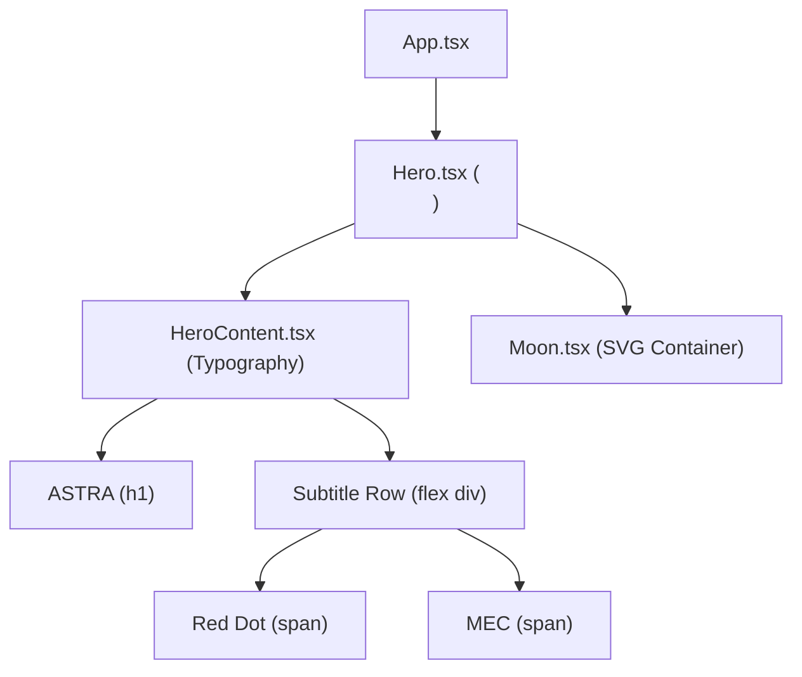
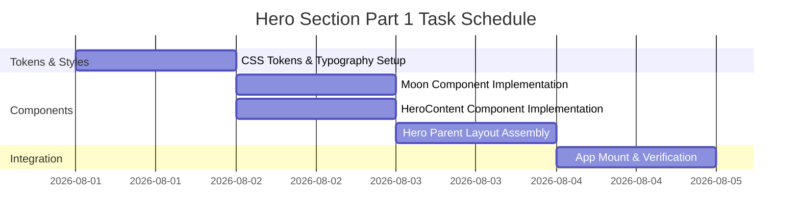

# Project ASTRA — Landing Hero Design System & Implementation Plan (Part 1)

> **Document Target**: `docs/design-system.md`  
> **Feature**: ASTRA Landing Hero — Part 1 (Static Visual Foundation)  
> **Design References**: Visual Context [`Frame 1.png`](file:///F:/Programming/ASTRA/test2/docs/Frame%201.png) | Vector Asset [`moon.svg`](file:///F:/Programming/ASTRA/test2/src/assets/hero/moon.svg)  
> **Tech Stack**: React, TypeScript, Vite, Tailwind CSS, Framer Motion

---

## 1. Executive Summary

This document establishes the frontend architecture, visual design system tokens, layout structure, component composition, and atomic development roadmap for **Part 1 of the ASTRA Landing Hero section**.

The goal of Part 1 is to construct the static visual foundation of the initial hero viewport exactly as visualised in [`Frame 1.png`](file:///F:/Programming/ASTRA/test2/docs/Frame%201.png). The viewport contains strictly three elements:
1. Primary Title: **ASTRA**
2. Subtitle Row: **. MEC** (featuring a solid scarlet red accent dot)
3. Celestial Background Vector: **[`moon.svg`](file:///F:/Programming/ASTRA/test2/src/assets/hero/moon.svg)**

All animations, motion triggers, scroll interactions, and subsequent sections are explicitly excluded from Part 1.

---

## 2. Requirements

### Functional Requirements
- **Hero Viewport Construction**: Render a full-height opening hero viewport (`100dvh`) anchored at the top of the landing page.
- **Typography Layout**:
  - Primary title **"ASTRA"** rendered in high-contrast Didone/Serif display typography, uppercase, left-aligned.
  - Subtitle row featuring a solid circular red dot (`.`) inline with uppercase text **"MEC"** matching the serif style of the primary title.
- **Vector Asset Placement**:
  - Render crescent moon graphic using [`moon.svg`](file:///F:/Programming/ASTRA/test2/src/assets/hero/moon.svg).
  - Position crescent moon on the right half of the hero viewport, arching from top-right down towards center-right.
- **Visual Composition**: Match typography sizing ratios, dot proportion, contrast, letter spacing, and positioning of [`Frame 1.png`](file:///F:/Programming/ASTRA/test2/docs/Frame%201.png).
- **Responsive Adaptability**: Adapt layout seamlessly across Mobile (<768px), Tablet (768px–1024px), and Desktop (>1024px) viewports without horizontal scrolling or text overlap.

### Non-Functional Requirements
- **Zero Layout Shift (CLS = 0)**: Viewport dimensions and fluid font clamp calculations prevent layout shifts.
- **Accessibility Compliance**: Semantic HTML (`<section>`, `<h1>`, `<p>`), ARIA hidden attributes on decorational vector elements, WCAG AAA color contrast.
- **Zero External Dependencies**: Implemented using existing dependencies (React, TypeScript, Tailwind CSS).

### Exclusions (Part 1)
- Simple or complex Framer Motion animations
- Scroll interactions or Parallax effects
- Entrance transitions or fade-ins
- Page sections beyond the opening hero viewport

---

## 3. Assumptions

1. **Static Scope**: Part 1 covers only the visual foundation. Framer Motion hooks and timeline setups remain inactive until Part 2.
2. **Dynamic Viewport Units**: Use `100dvh` (dynamic viewport height) for the main section container to avoid toolbar jump issues on mobile browsers.
3. **Serif Font Loading**: High-contrast serif display font (*Playfair Display*, *Cinzel*, or *Bodoni Moda*) imported via `@font-face` / Google Fonts with system `serif` fallback.
4. **SVG Vector Asset**: [`moon.svg`](file:///F:/Programming/ASTRA/test2/src/assets/hero/moon.svg) is loaded as a responsive inline/imported SVG element within `src/features/hero/components/Moon.tsx`.

---

## 4. Existing Architecture

The existing project workspace uses a feature-sliced directory structure:

```text
src/
├── app/
│   ├── App.tsx
│   ├── main.tsx
│   ├── providers.tsx
│   └── router.tsx
├── assets/
│   └── hero/
│       └── moon.svg
├── components/
│   ├── common/
│   ├── layout/
│   └── ui/
├── features/
│   └── hero/
│       └── components/
│           ├── Hero.tsx
│           ├── HeroContent.tsx
│           └── Moon.tsx
└── styles/
    ├── globals.css
    ├── typography.css
    ├── utilities.css
    └── variables.css
```

---

## 5. Proposed Architecture

### Modular Component Breakdown



1. **[`Hero.tsx`](file:///F:/Programming/ASTRA/test2/src/features/hero/components/Hero.tsx)**: Top-level section orchestrator (`<section>`) providing black background space, dynamic height bounds (`100dvh`), relative stacking context, and overflow clipping.
2. **[`HeroContent.tsx`](file:///F:/Programming/ASTRA/test2/src/features/hero/components/HeroContent.tsx)**: Text hierarchy wrapper rendering `ASTRA` heading, spacing gaps, red accent dot, and `MEC` subtitle text.
3. **[`Moon.tsx`](file:///F:/Programming/ASTRA/test2/src/features/hero/components/Moon.tsx)**: Asset container for [`moon.svg`](file:///F:/Programming/ASTRA/test2/src/assets/hero/moon.svg) handling responsive scaling, aspect ratio preservation, and absolute alignment to the upper-right region.

---

## 6. Component Tree

### [`Hero.tsx`](file:///F:/Programming/ASTRA/test2/src/features/hero/components/Hero.tsx)
```tsx
import React from 'react';
import { HeroContent } from './HeroContent';
import { Moon } from './Moon';

export const Hero: React.FC = () => {
  return (
    <section 
      aria-label="Hero"
      className="relative w-full h-[100dvh] min-h-[600px] bg-black overflow-hidden select-none flex items-center justify-between"
    >
      <div className="container relative z-10 mx-auto h-full flex items-center px-6 sm:px-12 md:px-16 lg:px-24">
        <HeroContent />
      </div>
      <Moon />
    </section>
  );
};
```

### [`HeroContent.tsx`](file:///F:/Programming/ASTRA/test2/src/features/hero/components/HeroContent.tsx)
```tsx
import React from 'react';

export const HeroContent: React.FC = () => {
  return (
    <div className="flex flex-col items-start justify-center max-w-4xl z-10">
      <h1 className="font-serif-hero text-hero-title text-white uppercase leading-none tracking-tight">
        ASTRA
      </h1>
      <div className="flex items-center gap-3 sm:gap-4 md:gap-6 mt-2 sm:mt-4 md:mt-6">
        <span 
          className="inline-block w-3 h-3 sm:w-5 sm:h-5 md:w-7 md:h-7 lg:w-9 lg:h-9 rounded-full bg-accent-red shrink-0" 
          aria-hidden="true" 
        />
        <span className="font-serif-hero text-hero-subtitle text-white uppercase leading-none tracking-tight">
          MEC
        </span>
      </div>
    </div>
  );
};
```

### [`Moon.tsx`](file:///F:/Programming/ASTRA/test2/src/features/hero/components/Moon.tsx)
```tsx
import React from 'react';
import MoonSVG from '../../../assets/hero/moon.svg';

export const Moon: React.FC = () => {
  return (
    <div 
      className="absolute right-0 top-1/2 -translate-y-1/2 w-[85vw] sm:w-[65vw] md:w-[50vw] lg:w-[44vw] max-w-[750px] h-auto pointer-events-none z-0"
      aria-hidden="true"
    >
      
    </div>
  );
};
```

---

## 7. Data Flow

```text
[Pure Presentation Component]
       │
       ├── Reads CSS Tokens (--color-bg-space, --color-accent-red, --font-hero-serif)
       ├── Resolves moon.svg from static assets
       └── Renders static JSX nodes directly to DOM
```
No dynamic state management, API calls, or side effects required for Part 1.

---

## 8. State Management

- **Local Component State**: None required.
- **Global Application State**: None required.
- All components are pure presentation elements.

---

## 9. Routing Impact

- Standard root URL path (`/`). No changes to [`src/app/router.tsx`](file:///F:/Programming/ASTRA/test2/src/app/router.tsx).

---

## 10. API Integration

- N/A. Pure static visual implementation.

---

## 11. Styling Strategy

### CSS Design Tokens ([`src/styles/variables.css`](file:///F:/Programming/ASTRA/test2/src/styles/variables.css))
```css
:root {
  --color-space-black: #000000;
  --color-pure-white: #ffffff;
  --color-accent-red: #ff0000;
  --font-serif-hero: 'Playfair Display', 'Cinzel', Didot, 'Bodoni MT', Georgia, serif;
}
```

### Fluid Typography & Utility Classes ([`src/styles/typography.css`](file:///F:/Programming/ASTRA/test2/src/styles/typography.css))
```css
.font-serif-hero {
  font-family: var(--font-serif-hero);
}

.bg-accent-red {
  background-color: var(--color-accent-red);
}

/* Fluid Scalable Typography Rules */
.text-hero-title {
  font-size: clamp(3.75rem, 12.5vw, 11.5rem);
  line-height: 0.88;
  letter-spacing: -0.015em;
}

.text-hero-subtitle {
  font-size: clamp(3rem, 10vw, 9.25rem);
  line-height: 0.88;
  letter-spacing: -0.015em;
}
```

### Color Palette Summary
- Background Space: Deep Black (`#000000`).
- Typography Color: Pure White (`#FFFFFF`).
- Accent Dot Color: Scarlet Crimson (`#FF0000`).

---

## 12. Accessibility Checklist

- [x] **Semantic Structure**: Main hero section wrapped in `<section aria-label="Hero">`.
- [x] **Single H1 Landmark**: Title **ASTRA** formatted as `<h1>` heading.
- [x] **WCAG AAA Color Contrast**: White text on black background provides maximum contrast (21:1 ratio).
- [x] **Aria Hidden Elements**: [`moon.svg`](file:///F:/Programming/ASTRA/test2/src/assets/hero/moon.svg) and red accent circle hidden from screen readers (`aria-hidden="true"`).
- [x] **Screen Reader Flow**: Text content reads logically as "ASTRA MEC".
- [x] **Dynamic Viewport**: `100dvh` prevents mobile browser chrome overflow and horizontal scrollbars.

---

## 13. Responsive Strategy

| Target Device | Breakpoint Range | Moon Vector Scale & Position | Title Sizing (`ASTRA`) | Subtitle Sizing (`. MEC`) | Red Dot Size |
| :--- | :--- | :--- | :--- | :--- | :--- |
| **Mobile** | `< 768px` | `w-[85vw] max-w-[380px]`, top 50% right offset | `clamp(3.75rem, 14vw, 5.5rem)` | `clamp(3rem, 11vw, 4.5rem)` | `12px x 12px` |
| **Tablet** | `768px - 1024px` | `w-[60vw] max-w-[550px]`, centered right | `clamp(5.5rem, 11vw, 8rem)` | `clamp(4.5rem, 9vw, 6.5rem)` | `20px x 20px` |
| **Desktop** | `> 1024px` | `w-[44vw] max-w-[750px]`, center-right anchored | `clamp(8rem, 12.5vw, 11.5rem)` | `clamp(6.5rem, 10vw, 9.25rem)` | `28px x 28px` |

---

## 14. Performance Plan

1. **Asset Optimization**: [`moon.svg`](file:///F:/Programming/ASTRA/test2/src/assets/hero/moon.svg) is clean vector SVG.
2. **Font Loading Strategy**: Load serif display font with `font-display: swap;` to prevent render blocking or invisible text flashes (FOIT).
3. **Cumulative Layout Shift (CLS)**: Hardcoded aspect ratios and CSS `clamp()` ensure layout dimensions remain stable during page mount.
4. **Lightweight Bundle**: Zero third-party runtime dependencies added.

---

## 15. Implementation Tasks



### Task 1: CSS Design Tokens & Fluid Typography Rules
- **Files Affected**: [`src/styles/variables.css`](file:///F:/Programming/ASTRA/test2/src/styles/variables.css), [`src/styles/typography.css`](file:///F:/Programming/ASTRA/test2/src/styles/typography.css)
- **Goal**: Configure color variables, font families, and fluid `clamp()` utilities for typography.
- **Complexity**: Low
- **Parallelizable**: Yes

### Task 2: Build `Moon` Graphic Component
- **Files Affected**: [`src/features/hero/components/Moon.tsx`](file:///F:/Programming/ASTRA/test2/src/features/hero/components/Moon.tsx)
- **Goal**: Create responsive vector wrapper component for [`moon.svg`](file:///F:/Programming/ASTRA/test2/src/assets/hero/moon.svg).
- **Complexity**: Low
- **Parallelizable**: Yes

### Task 3: Build `HeroContent` Typography Component
- **Files Affected**: [`src/features/hero/components/HeroContent.tsx`](file:///F:/Programming/ASTRA/test2/src/features/hero/components/HeroContent.tsx)
- **Goal**: Implement primary title `<h1>ASTRA</h1>` and subtitle row `. MEC` with red accent dot.
- **Complexity**: Medium
- **Parallelizable**: Yes

### Task 4: Assemble `Hero` Parent Container
- **Files Affected**: [`src/features/hero/components/Hero.tsx`](file:///F:/Programming/ASTRA/test2/src/features/hero/components/Hero.tsx)
- **Goal**: Compose `HeroContent` and `Moon` components in full-height section container (`100dvh`).
- **Complexity**: Medium
- **Parallelizable**: No (depends on Tasks 1–3)

### Task 5: App Mount & Visual Verification
- **Files Affected**: [`src/app/App.tsx`](file:///F:/Programming/ASTRA/test2/src/app/App.tsx)
- **Goal**: Mount `Hero` component into root application view and verify visual fidelity.
- **Complexity**: Low
- **Parallelizable**: No (depends on Task 4)

---

## 16. Risks & Mitigation

| Risk Area | Severity | Impact | Mitigation Strategy |
| :--- | :--- | :--- | :--- |
| **Mobile Address Bar Shift** | Low | Height jump when browser URL bar hides/shows | Use dynamic viewport units (`100dvh`) with `min-h-[600px]` fallback. |
| **Moon Graphic Overlap** | Medium | Moon SVG covers text on small screens | Set text container to higher `z-index` (`z-10`) and moon to `z-0`. |
| **Serif Font Loading Delay** | Low | Text initially renders in default sans-serif font | Provide system serif fallbacks (`Georgia`, `serif`) and specify `font-display: swap`. |

---

## 17. Testing Strategy

### Automated Verification
- **Type Checking**: `npm run type-check` or `tsc --noEmit`.
- **Build Compilation**: `npm run build` using Vite.

### Manual Inspection Checklist
1. **Visual Accuracy**: Verify layout against [`Frame 1.png`](file:///F:/Programming/ASTRA/test2/docs/Frame%201.png).
2. **Red Dot**: Confirm circular shape, red color (`#FF0000`), and vertical alignment with "MEC".
3. **Viewport Scale**: Test across 375px (Mobile), 768px (Tablet), 1440px (Desktop) viewports.
4. **Zero Motion Check**: Confirm no Framer Motion animations or scroll triggers execute during load.

---

## 18. Acceptance Criteria

- [ ] Hero viewport renders with pure black background (`#000000`).
- [ ] Primary heading displays **ASTRA** in white display serif typography.
- [ ] Subtitle row displays a solid red dot (`#FF0000`) followed by **MEC** in matching serif typography.
- [ ] Crescent moon graphic [`moon.svg`](file:///F:/Programming/ASTRA/test2/src/assets/hero/moon.svg) is positioned on the right side.
- [ ] Section height fills 100% of viewport (`100dvh`) with no horizontal scrollbar.
- [ ] Zero animations, motion effects, or scroll listeners are active in Part 1 code.
- [ ] Application compiles cleanly without TypeScript or Vite build errors.

---

## 19. Open Questions

1. **Serif Font Source**: Do you prefer importing Google Font `Playfair Display` / `Cinzel` via HTML head link or local `@font-face` CSS import? (Currently configured with system serif fallback).

---